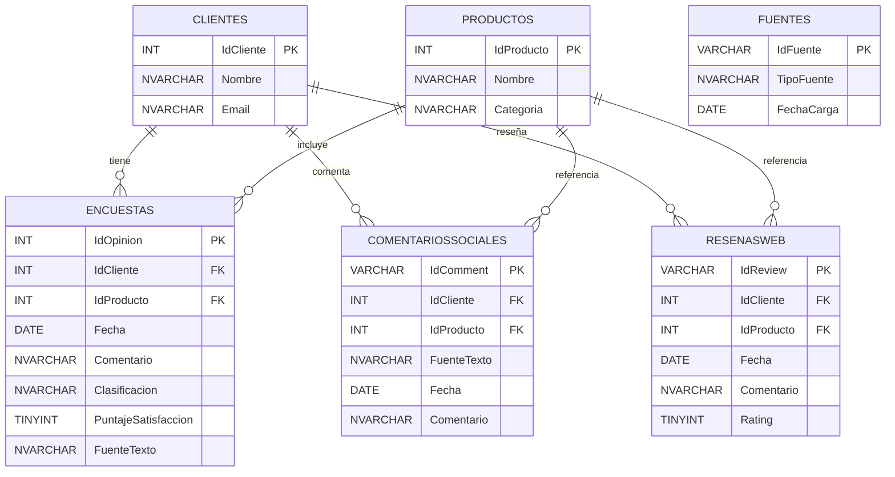

# 📘 Documento Breve – ETL Opiniones de Clientes

## 1. Descripción General
El proyecto implementa un proceso **ETL (Extract, Transform, Load)** en **Python** que integra distintas fuentes de datos 
(encuestas, comentarios sociales, reseñas web, clientes, productos y fuentes de datos) dentro de una base de datos 
SQL Server llamada **`OpinionesDB`**.  

El objetivo es centralizar la información de opiniones de clientes y estructurarla para futuros análisis de satisfacción, 
calidad de productos y gestión de clientes.

---

## 2. Flujo de Funcionamiento

1. **Extracción**  
   - Se leen los archivos CSV (`clients.csv`, `products.csv`, `fuente_datos.csv`, 
     `social_comments.csv`, `surveys_part1.csv`, `web_reviews.csv`).  
   - Todo se carga inicialmente como texto para evitar errores de formato.

2. **Transformación**  
   - Normalización de encabezados → (`Categoría → Categoria`, `Clasificación → Clasificacion`).  
   - Limpieza de IDs → se convierten `C019` o `P006` a enteros (`19`, `6`).  
   - Conversión de fechas a tipo `DATE`.  
   - Limpieza de texto y duplicados.  
   - Gestión de claves foráneas → si un cliente o producto no existe en su dimensión, se carga `NULL` en la tabla de hechos.

3. **Carga**  
   - Inserción de **dimensiones** (`Clientes`, `Productos`, `Fuentes`).  
   - Inserción de **tablas de hechos** (`Encuestas`, `ComentariosSociales`, `ResenasWeb`).  
   - Inserción idempotente: no se duplican registros existentes.

---

## 3. Diagrama de Base de Datos

---

## 4. Conclusiones
- El proceso ETL asegura integridad referencial mediante claves foráneas y uso de `NULL` cuando no se encuentra correspondencia.  
- El esquema es expandible: se pueden añadir nuevas fuentes de hechos sin alterar las dimensiones existentes.  
- La estructura facilita consultas sobre satisfacción de clientes, calidad de productos y tendencias de opiniones.
